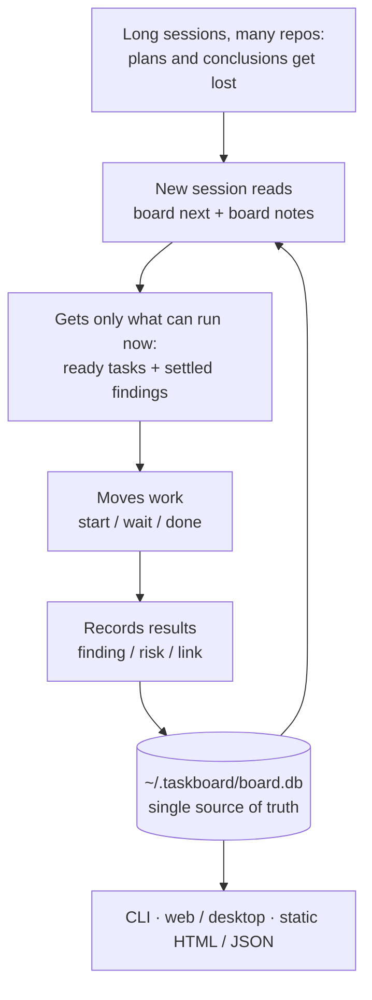

# taskboard

English · [中文](README.zh.md)

A task board for one person working with AI coding agents. In long Claude Code or Codex sessions the plan scrolls out of context, and when one piece of work spans several repos there is no single place that says what can start now and what is blocked. taskboard keeps tasks, dependencies, findings and risks in a local SQLite database, so a new session can pick up the work from a short brief.

It is standard-library Python with no third-party dependencies, and stores data in `~/.taskboard/board.db`. It does not do multi-user collaboration, permissions or cloud sync. The CLI and UI text are in Chinese.



## Install

```bash
brew install sunsssc/tap/taskboard
```

Or from source: `pip install -e /path/to/taskboard`. Both give you the `board` command; set `TASKBOARD_HOME` to move the data directory. Homebrew puts the Agent Skill at `$(brew --prefix)/share/taskboard/skill`.

## Connect your agents

The Agent Skill lives in `.agents/skills/taskboard`.

- **Codex and Claude Code:** `board skill-sync` copies it into both global skill folders (`--dry-run` to preview, `--target codex|claude` for one side).
- **Cursor:** found automatically inside this repo; for all projects, symlink it to `~/.agents/skills/taskboard`.
- **Gemini CLI:** symlink `SKILL.md` to `~/.gemini/taskboard.md`, add the line `@./taskboard.md` to `~/.gemini/GEMINI.md`, then run `/memory refresh`.

## Quick start

```bash
# Register a piece of work and the repos it touches
board init website-refresh --name "Website refresh" --repo ../website_backend --repo ../website_frontend

# Add tasks with priority, dependencies, a release gate and acceptance criteria
board add "Confirm scope" --priority P1 --repo website_backend --repo website_frontend
board add "Build pages" --priority P1 --blocked-by 1 --repo website_frontend --accept "Core flow smoke test passes"
board add "Release" --gate --priority P0 --blocked-by 2 --repo website_backend

# Move work
board start 1
board wait 1      # blocked on a person or an outside step
board done 1      # prints the acceptance criteria, records the commit range, shows what it unblocked

# Look
board brief            # handover summary for a new session
board next             # what can start now
board review --queue   # which changes to read today
```

`board --help` lists every command.

## Design

- **Three states, kept apart.** `todo`, `active` and `waiting`. A `waiting` task is blocked on a person, so it never counts as ready; `board next` lists it separately.
- **Findings, not just tasks.** `finding` records a settled fact so nobody re-derives it, `risk` records a loose end that does not block, and `link` points at a key file. Each is grouped by topic.
- **Concept alignment.** An agent uses `board concept` to write down a concept the human may lack, with the reason for the choice, anchored to a function. Only a person can `board align` it. If the anchored code changes later, the concept goes back to "needs realignment".
- **Review triage.** `board review --queue` ranks changes by whether they introduce concepts you have not aligned, not by size, and gives a one-line reason for each. Aligning a concept moves its changes to "can skip".
- **Commit ranges.** `start` records each linked repo's HEAD and `done` records the end, including inside git worktrees. If a rebase or squash breaks the range, it says so instead of showing a wrong diff.
- **Many repos.** A piece of work can span repos; in that case a new task must name its repos, so nothing is attached by guesswork.

## Viewing

| Entry point | What it does |
| --- | --- |
| `board serve --open` | Local web page that refreshes within 2 seconds of a CLI change; edits status, priority and concept alignment |
| Tauri desktop app (`apps/desktop`) | The same Vue page, plus dispatching a task to Codex or Claude Code |
| `board export --out board.html` | Self-contained static HTML that hides local paths by default |
| `board export --json` | JSON for other tools |
| macOS menu bar app (`macos/`) | Native AppKit shell that refreshes when the database changes |

`board serve` has no login. It accepts writes only when bound to a local address; don't expose it to a network.

## Development

```bash
python3 -m pytest tests -q
cd apps/desktop && npm run test && npm run build
cargo test --manifest-path apps/desktop/src-tauri/Cargo.toml
cd apps/desktop && npm run build:web   # after frontend changes; commit the rebuilt taskboard/web
```

Pushing a `v*` tag that matches `pyproject.toml` runs `.github/workflows/release.yml`, which tests, builds the source archive and Formula, and publishes the GitHub release. The data model and commit-range logic are in `taskboard/store.py` and `taskboard/gitref.py`; desktop notes are in [`apps/desktop/README.md`](apps/desktop/README.md).

## License

MIT
