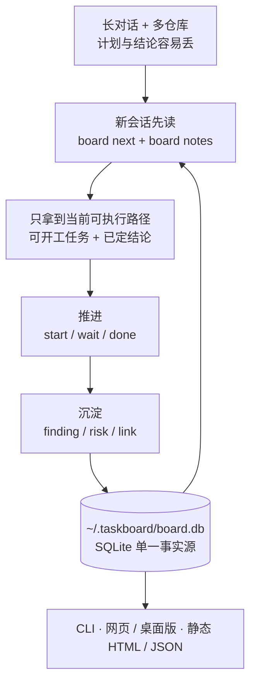

# taskboard

[English](README.md) · 中文

给个人和 AI 编程助手用的跨对话需求看板。和 Claude Code、Codex 长对话时，计划会滚出上下文；
一个需求跨多个仓库推进时，"现在能开工的是哪几件、谁卡着谁"没有统一的去处。taskboard 把
任务、依赖、结论和风险存进本地 SQLite，新会话读一段摘要就能接上。

纯标准库 Python，无第三方依赖；数据在 `~/.taskboard/board.db`。不做多人协作、权限或云同步。



## 安装

```bash
brew install sunsssc/tap/taskboard
```

或从源码安装：`pip install -e /path/to/taskboard`。两种方式都得到全局命令 `board`；
`TASKBOARD_HOME` 可改数据目录。Homebrew 安装的 skill 位于 `$(brew --prefix)/share/taskboard/skill`。

## 接入 AI Agent

Agent Skill 的唯一来源是 `.agents/skills/taskboard`。

- **Codex / Claude Code**：`board skill-sync` 同步到两端的全局 skill 目录（`--dry-run` 预览，
  `--target codex|claude` 只更新一端）。
- **Cursor**：打开本仓库时自动发现；全局可用需软链到 `~/.agents/skills/taskboard`。
- **Gemini CLI**：把 `SKILL.md` 软链为 `~/.gemini/taskboard.md`，并在 `~/.gemini/GEMINI.md`
  里加一行 `@./taskboard.md`，然后 `/memory refresh`。

## 上手

```bash
# 登记需求和涉及的仓库
board init website-refresh --name "网站改版" --repo ../website_backend --repo ../website_frontend

# 加任务：优先级、依赖、闸门、验收条件
board add "确认需求" --priority P1 --repo website_backend --repo website_frontend
board add "实现页面" --priority P1 --blocked-by 1 --repo website_frontend --accept "核心流程冒烟通过"
board add "发布上线" --gate --priority P0 --blocked-by 2 --repo website_backend

# 推进
board start 1
board wait 1      # 卡在人工或外部动作上
board done 1      # 打印验收条件，记录提交区间，提示解锁了谁

# 看
board brief       # 交接摘要，新会话读这一段就能接上
board next        # 现在能开工的
board review --queue   # 今天该读哪几条改动
```

`board --help` 列出全部命令。

## 设计要点

- **三种状态分开**：`todo`、`active`、`waiting`。`waiting` 等的是人，不算可开工，
  `board next` 单独列出。
- **记录结论，不只记任务**：`finding`（已判定的事实，不再重复推演）、`risk`（不阻塞但别丢）、
  `link`（关键文件入口），按主题分组。
- **概念对齐**：Agent 用 `board concept` 写下人可能缺的概念和选型理由，锚在代码函数上；
  只有人能 `board align`。锚点之后被改动的概念会转为"需重新对齐"。
- **审查分诊**：`board review --queue` 按"有没有引入未对齐的概念"排序改动，而不是按改动
  规模；每条附一行理由。对齐之后，对应改动会掉到"可跳过"。
- **提交区间**：`start` 记各关联仓库的 HEAD，`done` 记终点，支持 git worktree；
  rebase/squash 后区间失效会明说，不给错误的 diff。
- **多仓库**：需求可关联多个仓库，多仓库需求里新建任务必须指明仓库，不静默猜测。

## 查看

| 入口 | 说明 |
| --- | --- |
| `board serve --open` | 本机网页，CLI 改动 2 秒内刷新，可改状态、优先级、对齐概念 |
| Tauri 桌面版（`apps/desktop`） | 与网页同一份 Vue 页面，另可把任务派发给 Codex 或 Claude Code |
| `board export --out board.html` | 自包含静态 HTML，默认隐藏本机路径，可直接发布 |
| `board export --json` | 给其他工具用 |
| macOS 菜单栏 App（`macos/`） | 原生 AppKit 壳，监听数据库变化自动刷新 |

`board serve` 没有身份认证，只在本机地址监听时允许写入，不要暴露到公网。

## 开发

```bash
python3 -m pytest tests -q
cd apps/desktop && npm run test && npm run build
cargo test --manifest-path apps/desktop/src-tauri/Cargo.toml
cd apps/desktop && npm run build:web   # 改了前端后重新生成 taskboard/web，连同产物提交
```

数据模型、提交区间和并发的细节见 `taskboard/store.py` 与 `taskboard/gitref.py`；
桌面版的开发约束见 [`apps/desktop/README.md`](apps/desktop/README.md)。

## License

MIT
